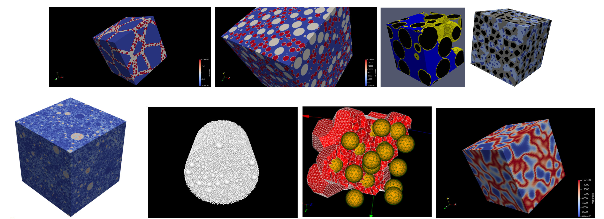
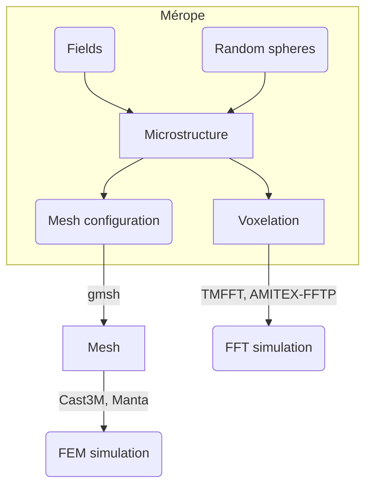
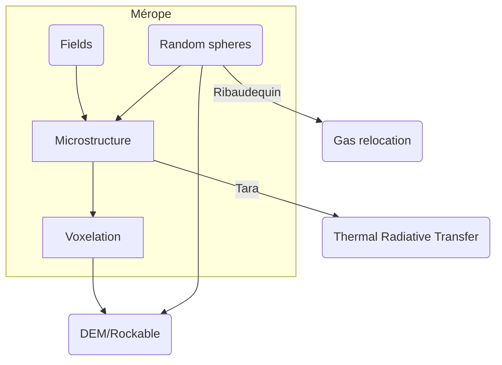

:warning: The use of Mérope is subjected to a licence, only available [in French](Licence.txt).

:warning: Unfortunately, some hyperlinks will not work properly for people without access to the internal resources of the CEA. We are sorry for this inconvenience.

# Mérope : What for ?

## Core business : simulation of random heterogeneous materials

Mérope is a code devoted to the design and discretization of microstructures of random heterogeneous materials.
In turn, these microstructures are studied from the point of view of homogenization, with the paradigm of Representative Volume Elements (see *e.g.* [Kanit et al., 2003](https://www.sciencedirect.com/science/article/pii/S0020768303001434?via%3Dihub)).
From this perspective, the effective behaviour of a heterogeneous material may be obtained by simulating it in a sufficiently large box.
From that simulation, relevant quantities are extracted (mostly by some averaging rules).

The core functionalities of Mérope are devoted to the microstructure generation and its voxelation.
However, it is also intended to provide simplified interfaces to mesh generation and solvers.
Two approaches are possible :
- Fast Fourier Transform (FFT) approaches, using the FFT algorithm to speed up computation on large boxes. However, it requires a regular voxelation grid.
- Finite Element Methods (FEM) approaches. These are usually slower for the same Degrees of Freedom (DoF) number and require a mesh, which may be non-structured. However, they allow for finer representations of the microstructures.

**Remark :** The above scheme is the objective ; some parts are not achieved yet.

## Additional applications

Mérope's core functionalities can be used in various contexts. In particular :
- voxelation of configurations of Discrete Element Method (DEM),
- initialization of DEM configurations by random spheres,
- computation of view factors in thermal radiative transfer (Tara),
- gaz relocation (Ribaudequin).

# OS and language

Mérope is implemented in C++ (and uses features of C++17). 
Nevertheless, this language is not intended to be used in order to writing scripts (although it works).
On the contrary, Python3 plays the role of an API, and is used as well as a pre- and post-processing tool.
For that reason, we exclusively describe the Python3 API, and not the C++ code.
Nevertheless, the developper may generate a doxygen documentation related to the latter.

Mérope is meant to compile on Linux OS, and continuous integration tests show that non-regression tests are successful as well on Debian 10 (Buster) and 11 (Bullseye), and on Ubuntu Jammy.

# Quick start

[Install and use](Install.md)

# Main functionalities

## Seeds generation

See [Sac_de_billes](modules/AlgoPacking), the module of Mérope for packing spheres into a given shape (in particular, a periodic cuboid).

## Microstructure

This section is only introductory and roughly exposes the philosophy of `Mérope` for building microstructures.  
For impatient reader searching for  :
- **precise features**, please follow the hyperlinks below to reach more specialized documentation,
- **examples**, please have a look at the [gallery](doc/Gallery.md).

### Phase-field representation

The microstructure is conceptualized by means of phase fields $\mathcal{M}:=\{\rho_i\}$ on the periodic cuboid.
Namely, fields $`\rho_i(x)`$ represent the concentration for phase $`i`$ at point $`x`$ (by default, $`i=0`$ corresponds to the matrix phase).

It is always assumed that $`\sum_i \rho_i(x)=1`$.
In case this is not satisfied, the functions $`\rho_i`$ are corrected by the following procedure :
- if $`\sum_i \rho_i(x)=C<1`$ then we replace $`\rho_0 \rightsquigarrow \rho_0 +(1-C)`$ (favoring the matrix phase),
- if $`\sum_i \rho_i(x)=C>1`$ then we renormalize $`\rho_i \rightsquigarrow \rho_i/C`$.

For turning this representation into a .vtk file amenable to computation with `tmfft` or `amitex_fftp`, we basically evaluate the functions $`\rho_i`$, by means of various strategies.
In our perspective, combining microstructures amounts to defining rules to combine phase fields representations $`\mathcal{M}_0, \mathcal{M}_1, \cdots `$ into another phase field representation $`\mathcal{M}`$.

### Specific microstructures

There are two main families of microstructures implemented in Mérope (see [MicroStructuresManual](doc/MicroStructuresManual.md)) : 
- the first one is based on non-intersecting **inclusions** and **polycrystals**.  More specifically, one may build
  - polycrystals modelled by means of Laguerre tesselation,
  - polyhedral inclusions inside a matrix,
  - spheropolyhedrons inside a matrix,
  - spherical inclusions inside a matrix,
  Surface layers may be defined inside any inclusion.
- the second one is based on real scalar **fields**. These may be deterministic or stochastic (anamorphosed gaussian fields).  

Microstructures simulated by Merope share the following features :
- They are **2D** as well as **3D** (By changing the postfix \texttt{\_3D} by 		\texttt{\_2D} in each Python class, the user may change the dimension).
- They are **periodic** in all directions, and defined inside a periodic cuboidal cell (=*torus* for mathematicians).
- They can be combined **recursively** (as long as it makes sense) by means of Boolean operations. This allows for a large variety of microstructures.  

## Voxelation

All the microstructures can be discretized by voxelation (*i.e.* on a Cartesian grid).
Voxels may contain *pure* or *composite* phases (see [Schneider, 2021](https://link.springer.com/article/10.1007/s00707-021-02962-1)).
 See [VoxellationManual.md](doc/VoxellationManual.md).

## Mesh (tetrahedric)

Simple Inclusion-based Structures can be meshed using tetrahedric meshes.
Special care should be dedicated to *periodic* boundaries of the mesh.
See [MeshManual.md](doc/MeshManual.md).  

## Physics and solvers

FE solvers and FFT solvers can be used in order to solve **mechanics** and **thermics**.

# Additional resources

- **Mérope internal components** :
  - [Gallery](doc/Gallery.md)
  - [MicroStructures](doc/MicroStructuresManual.md)
  - [Voxellation](doc/VoxellationManual.md)
  - [Mesh](doc/MeshManual.md)
  - [Sac_de_billes documentation](modules/AlgoPacking/ReadMe.md) (packing algorithms)

- **CEA internal resources** :
  - [Tutorial](https://www-git-cad.intra.cea.fr/DEC/collaboratif/mj263790/formation-merope)
  - [UsersClub](https://www-git-cad.intra.cea.fr/DEC/pleiades/merope/merope_nucleaire/-/blob/master/doc/Summary.md)
  - [Ribaudequin documentation](https://www-git-cad.intra.cea.fr/DEC/collaboratif/mj263790/ribaudequin) (gaz relocation)
  - [Tara](https://www-git-cad.intra.cea.fr/DEC/collaboratif/mj263790/tara) (Radiative transfer )

- **Used libraries** :
  - [Pybind11 documentation](https://pybind11.readthedocs.io/en/stable/index.html)
  - [Intel oneAPI Math Kernel Library documentation](https://www.intel.com/content/www/us/en/developer/tools/oneapi/onemkl.html#gs.pbpcvk)

- **Microstructure generators** :
  - [Voro++ documentation](http://math.lbl.gov/voro++/about.html) and [Voro++ interface](doc/voropp.md)
  - [Neper documentation](https://neper.info/)

- **FFT solvers** :
  - [tmfft documentation](doc/tmfft.md)
  - [AMITEX official documentation](http://www.maisondelasimulation.fr/projects/amitex/general/_build/html/index.html) and [Amitex interface](doc/Amitex.md)

- **Mesh generators** :
  - [gmsh](https://gmsh.info/)

- **FE solvers** :
  - [MFEM-MGIS](https://github.com/thelfer/mfem-mgis)

- **Visualization**
  - [paraview](https://www.paraview.org/)
  - [ovito](https://www.ovito.org/about/)

- **Post-processing** :
  - [Post-processing facilities](doc/Post_processing.md)

# Miscellaneous

- [Known or expected bugs](doc/Bugs.md)
- [Performances](doc/Performances.md)
- [Credit](https://www-git-cad.intra.cea.fr/DEC/pleiades/merope/merope_nucleaire/-/blob/master/doc/Contributors.md)
- [Development guidelines](doc/Development.md)

# To-do list

[To-do list](https://www-git-cad.intra.cea.fr/DEC/pleiades/merope/merope_nucleaire/-/blob/master/doc/ToDoList.md)
