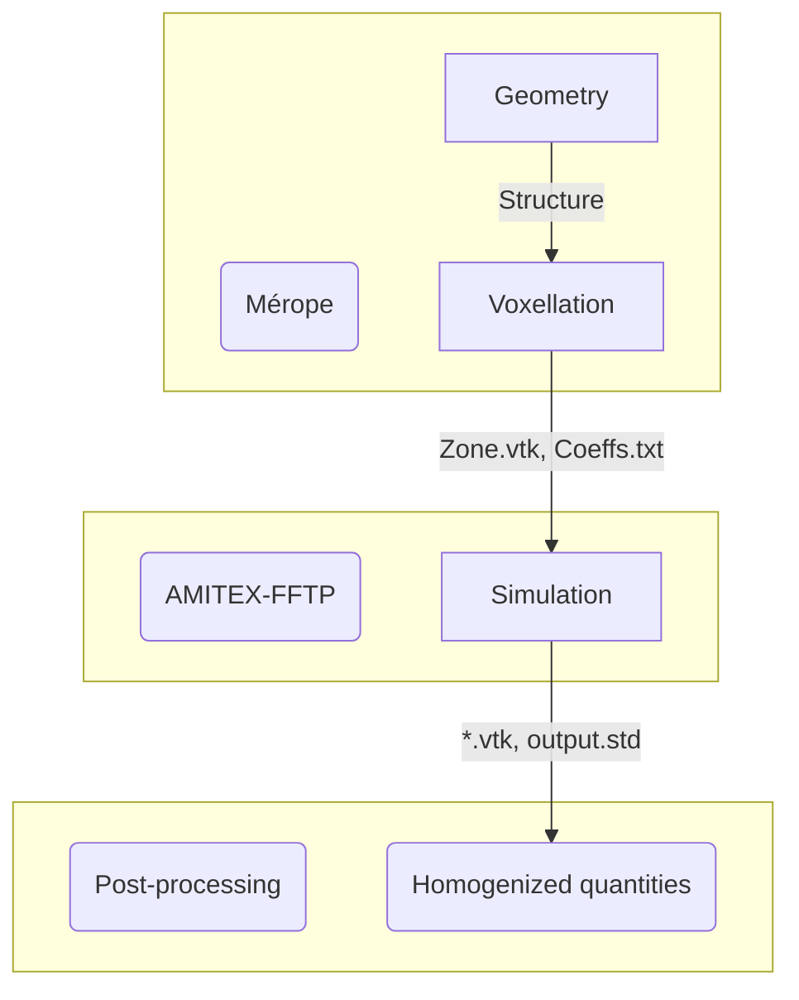

[[_TOC_]]

# AMITEX-FFTP

`AMITEX-FFTP` is a parallel FFT solver, mostly for mechanics and thermics.
It is written in `Fortran`, and its native interface is mostly in `.xml` format.

## Disclaimer

`Mérope` does not take part in developping `AMITEX-FFTP`, nor in providing documentation for it.
The official documentation for `AMITEX-FFTP` is given [here](http://www.maisondelasimulation.fr/projects/amitex/general/_build/html/map-site.html).
However, in order to *facilitate* some computations, `Mérope` proposes a simplified `Python` interface to `AMITEX-FFTP`.
For advanced functionalities, the reader is encouraged to refer to the official documentation.

# Mérope and AMITEX-FFTP : How to coordinate them ?

The basic idea is the following : `Mérope` builds the geometry and the voxellation, `AMITEX-FFTP` does the simulation.
Last, some post-processing functionalities are available.

Basically, `Mérope` generates a file `Zone.vtk` that contains a voxellation of the RVA into the zones (=phases).
For *thermics*, it simultaneously generates a coefficient fiels for thermal conductivity. The latter is transferred to `AMITEX-FFTP` through a file `Coeffs.txt` (the **name** is important), which contains the thermal coefficient of each phase.
When using [composite voxels](doc/VoxellationManual.md), each zone in `Zone.vtk` basically correspond to a certain percentage of the actual phases. (For example, it may contain zone = 0 for 0% phase A and 100% phase B, zone = 1 for 1% phase A and 99% phase B, etc.).

# Python classes

## Launching AMITEX through a python interface

See [amitex_wrapper.py](tools/python/interface_amitex_fftp/amitex_wrapper.py).

- `computeThermalCoeff("Zone.vtk",number_of_processor)` : compute the homogenized thermal coefficient related to the voxellatin `Zone.vtk`, (with implicit coefficients given by `Coeffs.txt` in the folder).

## Post-processing AMITEX results

See [post_processing.py](tools/python/interface_amitex_fftp/post_processing.py).

- `readThermalFluxGrad(nameFile)` : get the thermal flux, and the thermal gradient from the file `nameFile` (typically `output.std`) produced by `AMITEX-FFTP`
- `printThermalCoeff(nameFolder)` : the folder is assumed to contain 3 subfolders names `result_1`, `result_2`, `result_3` (created by `amitex_fftp.Lancement_AMITEX.computeThermalCoeff("Zone.vtk",number_of_processor)`), and each of them should contain a file `output.std`. Then, the function `printThermalCoeff` prints and return the matrix of the thermal conductivity.

# Examples

## Computation of the thermal conductivity

See [Thermal_amitex.py](tests/didacticExamples/buildVoxellation/Thermal_amitex.py).  

