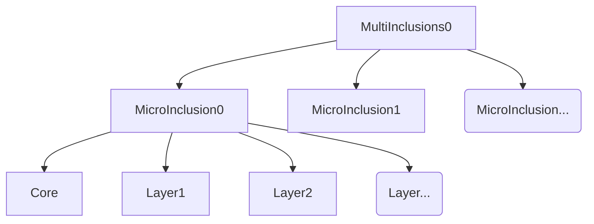
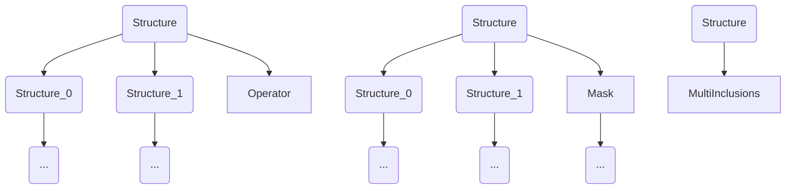
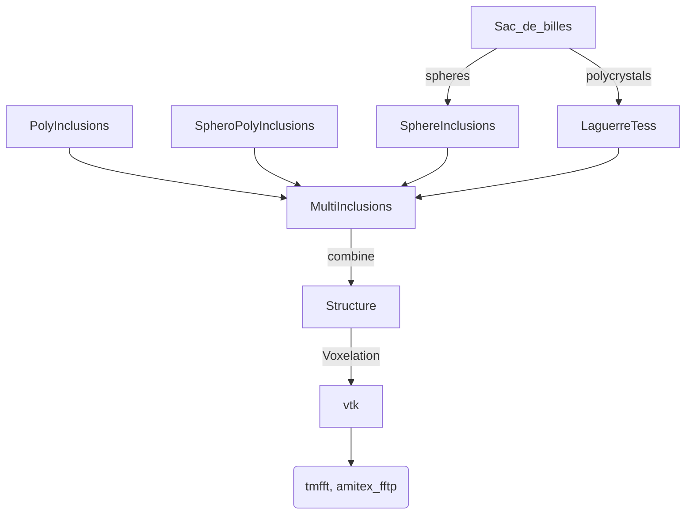
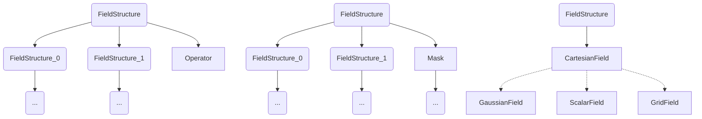
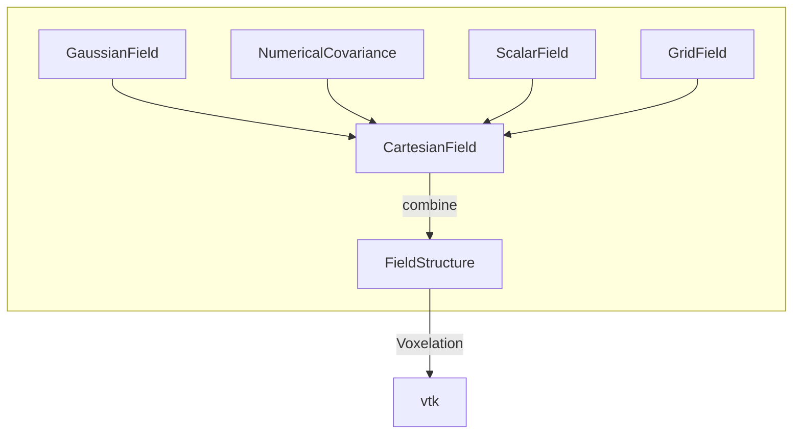

**Remark** : All the Python command correspond 1 to 1 to C++ commands. Consider reading the doxygen documentation for more details.

**Remark** : All the classes and functions can be subscripted `_3D` or `_2D` depending on the dimension of the considered space.

This page is devoted to the abstract framework hidden in Mérope. For concrete examples, please have a look at the [gallery](/doc/Gallery.md).

# Inclusion-based structures

This family of microstructures emulates geometric microstructures based on non-intersecting inclusions and polycrystals.
Surface layers may be defined inside any inclusion.

## A recursive definition

The simplest microstructures are described by `MultiInclusions_3D`, which themselves are collections of inclusions `MicroInclusion_3D` with layers.


More complex microstructures are obtained by combining recursively the `MultiInclusions_3D`.
The resulting combination are defined by `Structures_3D`, which are of three types :
- a simple `MultiInclusion_3D`,
- two `Structure_3D`, the local phases of which are transformed by an operator into a third phase,
- two `Structure_3D`, the local phases of which are chosen according to a mask.



## Computation pipeline :



Description of the main components :
- [***Sac_de_billes***](../modules/AlgoPacking/ReadMe.md) : places spheres inside the domain,
- ***MultiInclusions*** : collection of *disjoint* inclusions, either polyhedral or spherical. Layers can be added to these inclusions. Phases of each component can be modified.
  - ***SphereInclusions*** : spherical inclusions.
  - ***LaguerreTess*** : a Laguerre tessellation (uses voro++ to build the graph).
  - ***PolyInclusions*** : polyhedral inclusions.
  - ***SpheroPolyInclusions*** : spheropolyhedral inclusions.
- ***Structure*** : combination of many MultiInclusions. Hence, intersection of different inclusions can be processed.
- ***Voxellation*** : takes a structure and turns it into a voxelized grid. See [VoxellationManual](/doc/VoxellationManual.md) for more information on the way of voxelizing.
- ***vtk*** : a `.vtk` file which can be used by solvers.


## Precise definition of each component of Inclusions-based Structures

### The smallest component : MicroInclusion

This is a convex inclusion (a *convex polyhedron*, a *sphere*, or a *spheropolyhedron*). It is covered by a *core*, and potentially, many *layers* (of uniform width).

**Index convention** for layers :
- 0 : the core of the MicroInclusion.
- 1--n : from outer to inner layers.
This convention has the advantage of only changing the core when adding another layer.
Notice that layers are defined by a distance to the surface of the MicroInclusion; hence, some of them might be empty.


#### The spheres

These are the main ingredients to build the primitives.
They have 3 properties:
- `center` : a point in $\mathbb{R}^3$,
- `radius` : a positive scalar parameter,
- `phase` : a nonnegative integer.
They are usually generated by `Sac_de_billes` but may as well be created and modified as objects in the python script (see [hexagones.py](/tests/1_tests_meshGeneration/hexagones/hexagones.py)).

#### The polyedra

These are convex objects obtained by intersecting a finite number of halfspaces. They can alternatively be described by their boundaries, that is a family of flat faces $(F_{i})_{i \in \{1, n\}}$ described by their vertices $(v_{i})_{i \in \{1, m\}}$.
Polyhedrons are implemented as non-interactive objects. 

**Main classes and methods** :
- `microInclusion.ConvexPolyhedronInc_3D` : object containing a polyhedron, with no method.
- `microInclusion.PolyhedronFactory_3D()` : create a polyhedron factory, with a single method
  - `fromVertices(phase, vertices, face_indices)` : return an object `microInclusion.ConvexPolyhedronInc_3D`, caracterized by a `phase`, a list of `vertices = [[v_1x, v_1y, v_1z], ..., [v_mx, v_my, v_mz]]`, and a list `face_indices = [[i_11, i_12, .., i_1N(1)], ..., [i_n1, ..., i_nN(n))] ]` such that the face $F_k$ has vertices $v_{i_{k1}}, \cdots v_{i_{kN(k)}}$, ordered such that the edges of the face are $[v_{i_{kj}}, v_{i_{k(j+1)}}]$, and that the boundary is followed in the trigonometric sense w.r.t. the outer normal of the face.

#### The spheropolyhedra

A SpheroPolyhedron $S$ is obtained by constructing first a Polyhedron $P$, choosing a Minkowski radius $r>0$ and saying that a point $x \in S$ iff. ${\rm dist}(x, P) < r$. Pictures are found below for SpheroPolyhedron relative to an octahedron and a prism, respectively.
SpheroPolyhedrons are implemented as non-interactive objects. 

**Main classes and methods** :
- `microInclusion.SpheroPolyhedronInc_3D` : object containing a spheroPolyhedron, with no method.
- `microInclusion.SpheroPolyhedronFactory_3D()` : create a spheroPolyhedron factory, with a single method
  - `fromVertices(phase, vertices, face_indices, minkowskiRadius)` : return an object `microInclusion.SpheroPolyhedronInc_3D`. The parameters `phase, vertices, face_indices` are for building the underlying polyhedron (see `microInclusion.PolyhedronFactory_3D.fromVertices`) and the parameter `minkowskiRadius` describes the Minkowski radius.

<div align="center">


</div>


### Primitives for building MultiInclusions

The main initial structures are :
- Sphere Inclusions `SphereInclusions_3D`,
- Laguerre Tessellations `LaguerreTess_3D`,
- Polyhedrons Inclusions `PolyInclusions_3D`,
- SpheroPolyhedrons Inclusions `SpheroPolyInclusions_3D`.
Each of them is a collection of MicroInclusions.

**Phases** : the phases of the inclusions of the primitives are determined by the phases of the MicroInclusions (spheres, polyhedrons, spheropolyhedrons) that are given.

#### Spheres Inclusions

Contain non-intersecting spheres inside the periodic cuboid.

**Main methods** :
- `SphereInclusions_3D()` : trivial constructor.
- `setLength([L1,L2,L3])` : set the dimensions of the periodic cuboid.
- `setSpheres([Sphere1, Sphere2, Sphere3,...]])` : set the spheres from a list of Spheres.
- `fromFile(file1)`: set the spheres from a file written in the VER format.
- `getSpheres()` : obtain the list of spheres.

#### Laguerre Tessellation

##### Define a Laguerre Tessellation

Build a Laguerre tessellation from a list of spheres.
A Laguerre tessellation is a collection of tessels $X_i$ covering the periodic cuboid, such that $x \in X_i$ if :
```math
|x-c_i|^2 -r_i^2 \leq |x-c_j|^2 - r_j^2 \qquad \forall j \in \{1,...,N\}.
```
Here, $c_i$ and $r_i$ can be seen as the center and radius of a sphere.

**Remark** : Laguerre tessellations generalize *Voronoi Tessellations* in the following sense : for Voronoi tessellations, all the radii $r_i$ are equal to a single value $r$ -and in general $r=0$.

**Main methods** :
- `LaguerreTess_3D([L1,L2,L3], sphereList)` : constructor, build from a list of spheres.
- `computeTessels()` : build the tessellation (for later purpose).
- `toPolyInclusions()` : return an object of type `PolyInclusions_3D`, *forgetting* that a Laguerre tessellation paves the torus.
- `setAspRatio([aspRatio1, aspRatio2, aspRatio3])` : set a uniform aspect ratio on the whole periodic cuboid (in practice, the tessellation is built on a dilatated periodic cuboid and then squeezed back to the initial periodic cuboid). Same convention as *Neper*.
  Mathematically speaking, it boils down to the pre-process transform :
  ```math
		x \mapsto \hat{x} \qquad \text{for} \qquad \hat{x}_i = \frac{1}{a_i} x_i,
  ```
  where the aspect ratio $a_i$ is normalized such that
	```math
		a_i = \texttt{aspRatio}[i] \left( \prod_{j=1}^d \texttt{aspRatio}[j] \right)^{-\frac{1}{d}}.
	```
	Thus, the criterion for $x$ being in tessel $X$ of center $c$ and radius $R$ is minimizing
	```math
		|\hat{x} - \hat{c}|^2 - R^2 = \sum_{j=1}^d \frac{|x[i] - c[i]|^2}{a[i]^2} - R^2.
	```

**Remark** : Due to the use of `voro++`, more functionalities might be available upon request (orientation or area of the surfaces between crystals, Delaunay graph...).

:warning: The ordering of the spheres is not preserved! Indeed, the spheres are sorted by phase.


##### Optimizing the input an getting informations

###### Optimizing the volume of each tessel

*Before* building a Laguerre tessellation, it is possible to prescribe the volume of each tessel $|X_i|$ by only optimizing the radius $r_i$ of the tessels, letting their seeds $c_i$ fixed. Our implementation of such an optimized preprocessing follows [Kuhn & al, 2020](https://www.sciencedirect.com/science/article/pii/S0045782520303601), which uses a Barzilai-Borwein gradient-descent algorithm.

It may lead to tessellations where all tessels have equal volumes, or where the is a clear gradient inside the structure.
For example, in the Figure below, from left to right, we show the original Laguerre tessellation, and its modifications where all the tessels have equal volumes, and then where the central tessels are smaller than the others on the periphery.
See [optimize_Laguerre_tess](/tests/microstructures/optimize_Laguerre_tess/optimize_Laguerre_tess.py).

<div align="center">


</div>


**Main methods** :
- `algo = algo_fit_volumes_3D([L1, L2, L3], sphereList, desiredVolumes)` : Initialize the algorithm for optimizing the radius $r_i$ of each tessel $X_i$, such that its volume is finally equal to `desiredVolumes[i]`.
- `algo.proceed(max_delta_Volume, max_iter, verbose)` : Launches the algorithm.
  - `max_delta_Volume` : prescribed tolerance of the value of the volume of each tessel.
  - `max_iter` : maximum number of iterations.
  - `verbose` : if `True`, display information.
- `getCenterTessels()` : after the algorithm has proceeded, return the optimized seeds for Laguerre tessellation.
- `maxDeltaVolumes()` : return the maximal error between the prescribed and attained volumes after optimization.
- `getCurrentVolumes()` : return the list of volumes of tessels.

###### Building centroidal tessellations

It is also possible to attempt to make the tessellation more centroidal. *Nevertheless, this feature is **not very statisfactory** because of the poor quality of the optimization and the slowness of the process.*
We used [Kuhn & al, 2020](https://www.sciencedirect.com/science/article/pii/S0045782520303601) for the strategy, based on the Anderson acceleration of the Lloyd algorithm.

**Main methods** :
- `makeCentroidal([L1,L2,L3], sphereList, max_iter, stopping_criterion, use_acceleration, verbose)` : inplace modify the input `centerTessels` by moving the related centers so that the associated tessellation is more centroidal.
  - `stopping_criterion` : the algorithm stops when the `l^2` norm of the centers move is smaller than it.
  - `use_acceleration` : if `True`, enables the Anderson acceleration. Should be set `True`.
  - `verbose` : if `True`, display information.


#### Polyhedron inclusions and spheropolyhedron inclusions

These two similar classes are based on an identic pattern, and simulate a matrix in which there are disjoint inclusions.

**Main methods** :
- `PolyInclusions_3D()` or `SpheroPolyInclusions_3D()` : trivial constructor.
- `setLength([L1, L2, L3])` : set the length of the periodic cuboid.
- `addInclusion(singleInclusion)` : add a new inclusion `singleInclusion` (of type `microInclusion.ConvexPolyhedronInc_3D` or `microInclusion.SpheroPolyhedronInc_3D` depending on the context).
- `setInclusions([inclusion_1, inclusion_2, ..., inclusion_N])` : set the list of inclusions inside the matrix to be the given list.

### MultiInclusions

Interface to manipulate microInclusions.
The main idea is the following : each microInclusion is designated by an *identifier*, which is a priori **different** from the phase.
Those in turn are used to modify the designated microInclusion.
The *identifiers* begin with 0 and ends with identifier (N-1), for N=number of microInclusions.

**Main methods** :
- `MultiInclusions_3D()`: trivial constructor.
- `setInclusions(primitiveInclusions)` : the microstructure is made of inclusions, given by the object `primitiveInclusions`, which is of type `SphereInclusions_3D`, `LaguerreTess_3D`, `PolyInclusions_3D` or `SpheroPolyInclusions_3D`.
- `enlarge(identifiers, width)` : enlarge each microInclusion designated by the identifier list.
  - `identifiers` : list of int, 
  - `width` : list of double (or a single double).
- `addLayer(identifiers, newPhase, width)` : add a new layer to microInclusions designated by the identifier list.
  - `identifiers` : list of int, 
  - `newPhase`: list of int (or a single int),
  - `width` : list of double (or a single double).
- `changePhase(identifiers, newPhase)` : change the **core** phase of the designated microInclusions
  - `identifiers` : list of int, 
  - `newPhase`: list of int.
- `setMatrixPhase(matrixPhase)` : set the matrix phase (default = 0)
- `getAllIdentifiers()` : list of all the identifiers of the microInclusions
- `getAllPhases()` : list of all the possible phases in the MultiInclusion (including the layers, but excluding the matrix);  some might be present in no voxel.
- `getAllPhases(layer_index)` : list all the phases at the index layer_index in the microInclusions
- `getAllCenters()` : list all the centers of inclusions
- `getIdentifiers(phaseList)` : get all the identifiers corresponding to microInclusions such that the core phase is in the given list


### Structures

The `Structure_3D` combines `MultiInclusions_3D` in a recursive way.
This is a flexible interface, but it *does* basically *nothing* : it only *conceptualizes* it.
Concrete computations are done when discretizing the `Structure_3D` (*e.g.*, by voxelizing it).

**Remark :** Although the microstructure description in the classes `MultiInclusions_3D` is explicit, it becomes implicit in the class `Structure`. This is adequate for voxelation, but might be difficult to transpose on the level of meshes.

**Remark :** The ways of combining phases are fully coherent with the phase field representation. It is possible to define masks that have 50% of one phase, and 50% of the other phase (in particular, for composite voxels). In this case, 50% of the phases of `structure_3D_1` and 50% of the phases of `structure_3D_2` are selected.

**Remark :** More **advanced** Structures can be defined in the C++ part of the code.

**Methods**
- `Structure_3D(multiInclusions_3D)` : initialize the structure with one `multiInclusion_3D`
- `Structure_3D(structure_3D_1, structure_3D_2, map)` : initialize the structure with 2 structures, `structure_3D_1`, `structure_3D_1`, that are combined through a dictionary `map`.
In words, the phase $1$ of the second structure activates the transformation of the phases of the first structure by means of `map` (somehow, `structure_3D_2` plays the role of a mask). More precisely, for $\{\rho^{[1]}_i\}$ the phase fields of structure $1$, $\{\rho^{[f]}_i\}$ the phase fields of the resulting structures, and $\theta$ the volume fraction of phase $1$ of structure $2$, we get 
  - if $\theta = 0$, $\{\rho^{[f]}_i\}=\{\rho^{[1]}_i\}$,
  - if $\theta \neq 0$, $\{\rho^{[f]}_i\}=\{(1-\theta)\rho^{[1]}_i\} \cup \{\xi_i\}$, where the new phases $\{\xi_i\}$ are obtained by concatenating the phase fields $\theta \texttt{map}(\rho^{[1]}_i)$.
- `Structure_3D(structure_3D_1, structure_3D_2, mask)` : initialize the structure with 3 structures. The result structure is built as follows : whenever the mask phase is $>0$, the phases of `structure_3D_2` are selected. When the mask phase is $\leq 0$, the phases of `structure_3D_1` are selected.
- `getAllPhases()` : : get all the possible phases (some might be present in no voxel).

### Simplified Interface (obsolete)

See [SimplifiedInterface.md](/doc/SimplifiedInterface.md).

# Fields

This family of microstructures is dedicated to real scalar fields, that is basically $f : Q \rightarrow \mathbb{R}$, where $Q$ is the periodicity cell.
These may be deterministic or stochastic.
Its primitives are :
- `ScalarFields_3D`,  which emulates a deterministic function `f` of the spatial variable `x`,
- `GaussianFields_3D`, which is actually an anamorphosed gaussian field,
- a discretized `GridField_3D`, which can be obtained by reading a `.vtk` file or by using functionalities of Mérope.

## A recursive definition

Fields are combinations defined by `FieldStructures_3D`, which are of three types :
- a simple `CartesianField_3D`, which itself is either 
    - a `GaussianField_3D`
    - a `ScalarField_3D`,
    - a `GridField_3D`,
- two `FieldStructure_3D`, the local values of which are transformed by an operator into a third values,
- two `FieldStructure_3D`, the local phases of which are chosen according to a mask.



*Remark* : In contrast with the `GaussianField_3D` and the `ScalarField_3D`, the discretized `GridField_3D` inherently comes with an underlying grid. Thus, attempting to discretize it on another grid may give rise to an error.


## Computation pipeline :



## Primitives

### Interface to lambda function

The user may appeal directly to Python functions to impose covariance and/or nonlinear transforms on fields.
Nevertheless, the mixture of Python, MKL and OpenMP does not work properly.
Hence, the strategy is to wrap the lambda function into C function pointer which represents a function $\mathbb{R}^d \rightarrow \mathbb{\R}$, and to give this pointer to the Mérope classes.  

This is performed by means of the `Interf_FuncPointer` class, using `Numba`. See [prescribedField.py](tests/microstructures/prescribedField/prescribedField.py) for an example.
In the sequel, objects `Interf_FuncPointer` can be used as a wrapper for lambda functions.

**Methods**
- `Interf_FuncPointer(C_address, [d, 1])` represents a function $f :\mathbb{R}^{d} \rightarrow \mathbb{R}$. 
Here, `C_address` is the pointer adress of a C function. (See the code here for obtaining such an address [prescribedField.py](tests/microstructures/prescribedField/prescribedField.py) via numba.)

:warning: **The user should be very cautious** when defining `Interf_FuncPointer`. Since it relies on a raw pointer, it is a very fragile feature and may lead to undefined behaviour when used uncautiously.  

:warning: Mérope may only accept pure Python lambda function when compiled without OpenMP.


### Gaussian Fields

The aim is to build stationary Gaussian fields $g(x)$ on the periodic cuboid, of zero mean, and of covariance function $c(x-y) = \langle g(y)g(y) \rangle$. On top of that, we apply an anamorphosis to retrieve a coefficient field $a(x) = A(g(x))$.  
We refer to [Gaussian random functions, Lifshits, 1995](https://link.springer.com/book/10.1007/978-94-015-8474-6) for the theory of Gaussian fields.

**Methods**
- `gaussianField.GaussianField_3D(covariance, nonlinear_transform)` : constructor for a `covariance` $c :\mathbb{R}^d \rightarrow \mathbb{R}$, and the `nonlinear_transform` $A : \mathbb{R} \rightarrow \mathbb{R}$. The parameters are lambda functions or `Interf_FuncPointer`.
- `gaussianField_3D.seed` : direct access to the seed property, for controlling the randomness of the field.

:warning: The analytical covariance that is imposed is **only approximately** the numerical covariance of the Gaussian field. To plot the numerical covariance, you may consider the class described below `NumericalCovariance_3D`.

### Numerical covariance (of a Gaussian field)

This class is intended to plot the actual covariance of the discretized Gaussian field, which correspond to the class `GaussianField_3D`. 

**Methods**
- `gaussianField.NumericalCovariance_3D(covariance)` : constructor for a Covariance from an `Interf_FuncPointer` `covariance` $c :\mathbb{R}^d \rightarrow \mathbb{R}$.

### Scalar Fields (defined by a function f(x))

This class contains a function $f$ depending on the spatial variable $x$.

**Methods**
- `merope.ScalarField_3D(lambdafunction)` when `lambdafunction` is an `Interf_FuncPointer` or a lambda function taking a 3D-vector argument and yielding a `double`.

### Discretized Grid Field

A representation of the P0 discretization of a field on a given cartesian Grid.
Such an object can be obtained from the methods:
- `get_PureRealField()` of `merope.vox.GridRepresentation_3D`
- `getField()` of `merope.Voxellation_3D` (*deprecated*)

### CartesianField

This is either a `GaussianField_3D`, a `NumericalCovariance_3D`, a `ScalarField_3D`, or a discretized `GridField_3D`, with the additional information of the size of the cuboid.

**Methods**
- `CartesianField_3D(gaussianField, [L1, L2, L3])` : constructor based on a `GaussianField_3D`, `[L1, L2, L3]` edgelenths of the cuboid.
- `CartesianField_3D(numericalCovariance, [L1, L2, L3])` : constructor based on a `NumericalCovariance_3D`, `[L1, L2, L3]` edgelenths of the cuboid.
- `CartesianField_3D(scalarField, [L1, L2, L3])` : constructor based on a `ScalarField_3D`, `[L1, L2, L3]` edgelenths of the cuboid.
- `CartesianField_3D(gridField, [L1, L2, L3])` : constructor based on a `GridField_3D`, `[L1, L2, L3]` edgelenths of the cuboid.

### FieldStructure

The  `FielStructure_3D` combines `CartesianField_3D` in a recursive way.
This is a flexible interface, but it *does* basically *nothing* : it only *conceptualizes* it.
Concrete computations are done when discretizing the `FielStructure_3D` (*e.g.*, by voxelizing it).

**Methods**
- `FieldStructure_3D(cartesianField_3D)` : initialize the structure with one `cartesianField_3D`
- `FieldStructure_3D(fieldStructure_3D_1, fieldStructure_3D_2, fieldStructure_3D_mask)` : initializes the structure with 3 structures. The resulting field is built as follows : whenever the mask value in $x$ is $>0$, the values of `fieldStructure_3D_2` are selected. When the mask phase is $\leq 0$, the phases of `fieldStructure_3D_1` are selected.
- `FieldStructure_3D(fieldStructure_3D_1, fieldStructure_3D_2, operator)` :  initialize the structure with 2 structures and an operator.
The resulting field is built as follows : its value at $x$ is $operator(f_1(x), f_2(x))$, 
where $f_1, f_2$ are the input fields.
