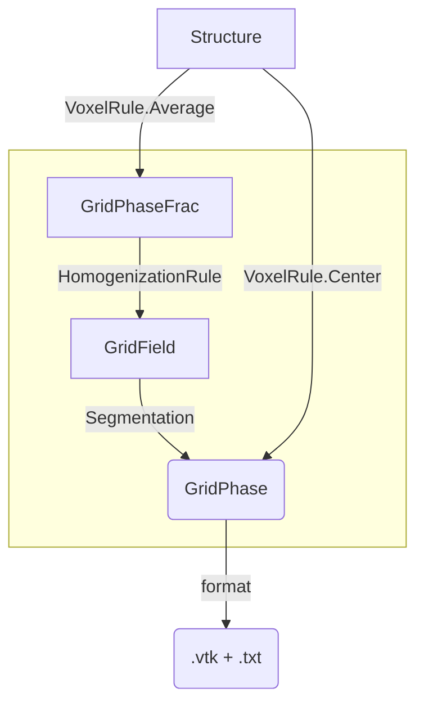

# Principles of the voxelation

The voxelation procedure aims at turning an abstract description of a structure into a cubic (or squared) regular mesh in order to perform a FFT computation with the underlying model phase-coefficient.
Finally, the aim is to put the voxelation in the TMFFT format or the [AMITEX format](http://www.maisondelasimulation.fr/projects/amitex/user_guide/_build/html/input_files.html).

:warning: Unfortunately, a typing error lies in the code, where the incorrect ''voxellation'' is used instead of the correct ''voxelation''. For retrocompatibility reasons, we maintain the word ``voxellation'' in the code.

# Ways of voxelizing

To compute the coefficient in each voxel, a combination of two rules is used :
- `VoxelRule` : either `Average` the phase w.r.t. the volume fractions of each phase on each voxel, or only evaluate the phase in the `Center` of the voxel.
- `HomogenizationRule` : `Voigt` (arithmetic average), `Reuss` (harmonic average), `Largest`, `Smallest`, to average the coefficient in case of `VoxelRule.Average`.

Then, the voxelation is segmented in phases according to the (scalar) values of the coefficient field.
The associated coefficient values are printed in a separated .txt file.
Hence, the voxelation comes with a list of coefficients associated to phases (`materialId` field of the .vtk file).
:warning: The relevance of this process is however limited to simple situations.In the long run, it is desirable to get
closer to a formalism where, in each voxel, the normal of the surface separating two different phases as well as the percentage of each phase are stored and then directly used by the solver. (This formalism is used by `AMITEX`.)

# Computation pipeline

Description of the main components :
- ***GridPhaseFrac*** : a grid representing the volume fractions of each phase. It is used to emulate composite voxels.
- ***GridField*** : a grid representing a scalar field
- ***GridPhase*** : a grid with only pure phase in its voxels
The way of discretizing a `Structure` into a `.vtk` file depend on the `VoxelRule`.

*Remark:*
The part inside a rectangle above is invisible to the `Python` user.

# Effects of discretization and composite voxels

In some situations (in particular, for high contrasts), composite voxels can save a lot of computational resources, see \[Schneider, 2021\].
We **highly recommend** to the user to proceed with a small (empirical) study of the discretization error before making use of large RVEs.
[Here is an example.](/studies/Voxels_composites)

Here is an example in which we consider lead spheres coated with gold inside water, and we search for the effective conductivity. The contrast is quite high ; indeed, the three materials have the following conductivities :
$\lambda_{\rm gold} = 317 Wm^{-1}K^{-1}$, $\lambda_{\rm lead} = 35.3Wm^{-1}K^{-1}$, $\lambda_{\rm water} = 0.606Wm^{-1}K^{-1}$.

We study the convergence of the effective conductivity computed by the RVE method, by only varying the discretization parameters.
The RVE under concern is fixed and quite small (with only 19 spheres).
We make use of the 5 different methods, namely `merope.VoxelRule.Center`, and `merope.VoxelRule.Average` with the following `homogenizationRule` : `merope.HomogenizationRule.Largest`,  `merope.HomogenizationRule.Smallest`, `merope.HomogenizationRule.Voigt`, `merope.HomogenizationRule.Reuss`.
When letting the discretization step go to 0, we observe :
- there is a high discrepancy in the results between the 5 methods, but no significant difference in terms of computation time,
- the `Reuss` method converges faster than the other ones. For 256 x 256 x 256 voxels (which is not small, since there are 1.6 1e7 voxels), the `Reuss` methods has a relative error of order 1%, the `Smallest` method has a relative error of order 10%, and the 3 other methods suffer from a relative error larger than 100%.

# Python methods

- Constructors and setters
  - `Voxellation_3D(multiInclusions_3D)` : constructor from a `MultiInclusions_3D`.
  - `Voxellation_3D(structure_3D)` : constructor from a `Structure_3D`.
  - `setPureCoeffs(coeffsList)` : associate to each phase `i` a coefficient `coeffList[i]`
    - :warning: For nonpositive coefficient values, does not work
    - :warning: The `coeffsList` is not verified to contain the `coeffList[i]`. It is highly recommanded to make use of method `getAllPhases` to verify it a priori
  - `setVoxelRule(voxelRule)` : define how to represent the content of each voxel. `voxelRule` is an object `VoxelRule.X` for `X` being `Average` or `Center`.
  - `setHomogRule(homogRule)` : define the rule to compute the coefficient of each voxel, from the percentage of each phase in it. Parameter `homogRule` is a object `HomogenizationRule.X` for `X` being `Reuss`, `Voigt`, `Smallest` or `Largest`.
- Functions
  - `proceed([N1, N2, N3], NMin=[0,0,0], NMax = [N1, N2, N3])` : build a voxelation of width `[N1, N2, N3]` voxels in the 3 directions. If the  optional parameters NMin and NMax are activated (both or none should be activated), extracts from the grid the voxels of indices `NMin[i]<=index[i]<NMax[i]`. It does it in an efficient way, avoiding to compute the whole grid.
- Ouptuts  
  - `getField_Numpy()` : return, if applicable, the output in the form of a numpy.array containing a scalar field.
  - `getField()` : return, if applicable, the output as a Mérope object `GridField`, which contains the output in the form of a scalar field.
  - `computePhaseGrid([N1, N2, N3])` :  build a voxelation of width `[N1, N2, N3]` voxels in the 3 directions and returns it in the form of a list describing in each voxel the percentage of each phase.
  - `printFile(Zone.vtk, Coeffs.txt)` : write 2 output files. The first one contains the *.vtk* file containing the zones of the material. The second one contains the associated coefficients (important for segmented image) in the ASCII format. These two outputs are expected by the `FFT` solvers.
  - `printFieldFile(File.vtk)` : write a single output file, containing the field (with real values).
