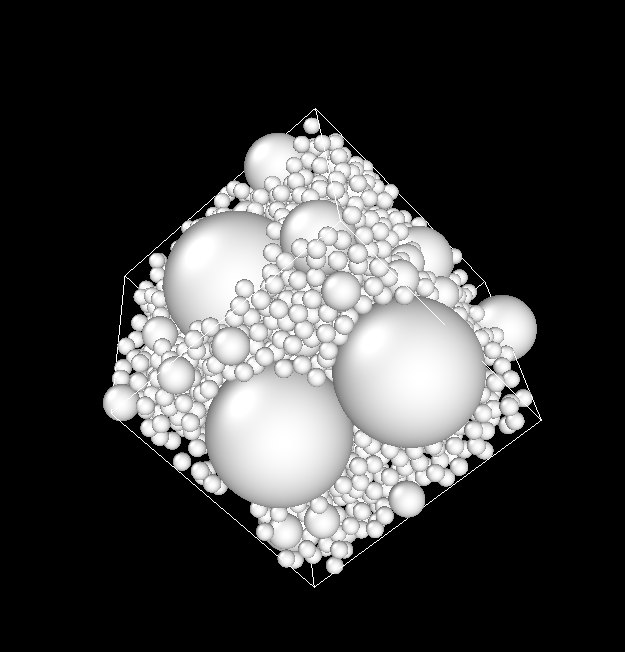
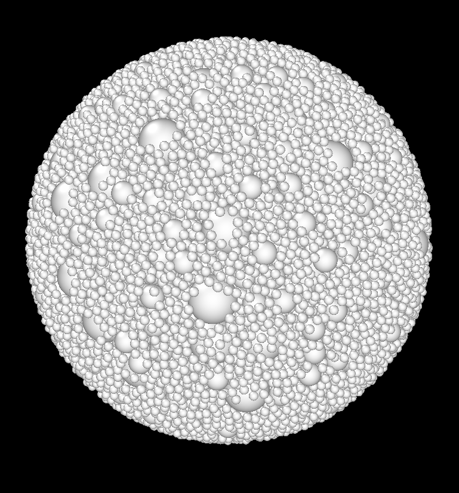
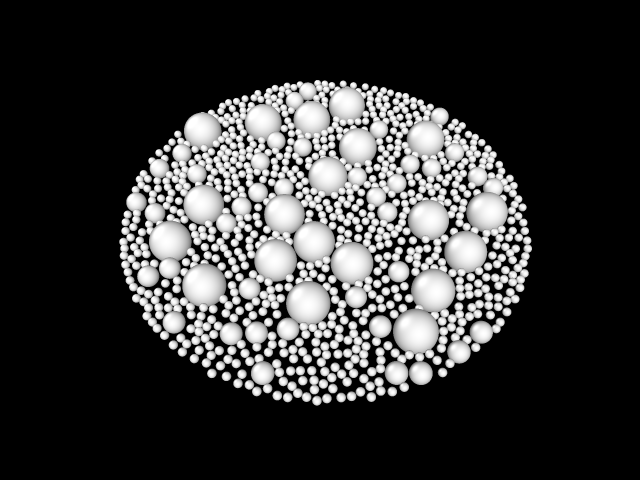
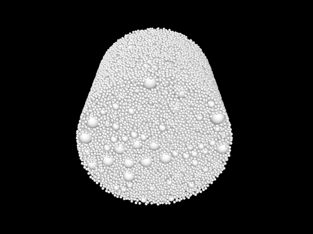
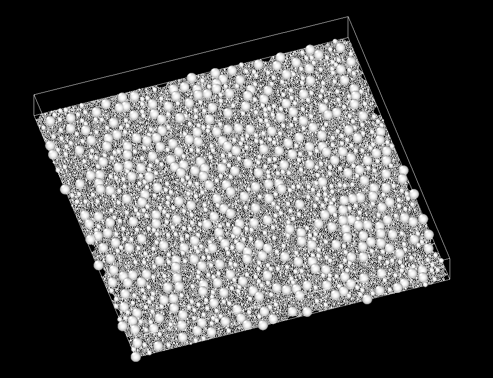

Sac_de_billes is a stand-alone module of Mérope dedicated to placing and packing spheres inside a simple shape.

# Table of contents

[[_TOC_]]

# Quick start

See [Install.md](Install.md)

# What for?
 Generate random configurations of :
   - non-intersecting balls, with two possible methods:
      - the RSA algorithm, based on [Ebeida et al, 2012](https://onlinelibrary.wiley.com/doi/full/10.1111/j.1467-8659.2012.03059.x);
      - the WP algorithm, that is a mechanical contraction algorithm of [Williams and Philipse, 2003](https://journals.aps.org/pre/abstract/10.1103/PhysRevE.67.051301);
   - intersecting balls, with a simple boolean algorithm simulating a Poisson Point Process .

# Description of the algorithms

## The RSA algorithm

1. The desired radii of the spheres are sorted in nonincreasing order.
2. For each radius R, the following happens:
   - if no more sphere can be placed `break`,
   - a candidate sphere S of radius R is randomly chosen inside the global shape,
   - if S intersects an already placed sphere, then, go to the previous line. Otherwise, it is accepted.
3. The algorithm terminates if all the desired spheres has been placed, or if no more sphere can be placed (then, the configuration of spheres is guaranteed to be *packed*).

*Remark:* The step 1 may not be standard from a theoretical point of view, but is motivated by the fact that:
- higher volume fraction can be achieved,
- it is difficult to give a guarantee that the configuration is packed if the radii are not sorted.

## The WP (Williams-Philipse) algorithm

This algorithm is more involved than the RSA algorithm.
However, it may be used to attain *higher packing ratio* (from 38% to 60% in 3D for monodisperse sphere distributions).
Unlike the RSA algorithm, there is no notion of packed configuration : the more the sphere are packed, the more time it takes to add new spheres.
By nature, the WP algorithm produces a configuration which is *more heterogeneous* than the RSA : clusters of glued spheres appear. Also, the random ensemble implicitly depends on the way the algorithm is done (unlike the RSA), such as how the radii are increased, how the spheres are moved away when overlapping etc.

The algorithm is the following :
1. Preprocessing steps :
   - Fix the desired number of spheres with their radii.
   - Generate a RSA configuration with the radii of all spheres decreased by a factor `AlgoWP<DIM>::RADIUS_MULT` < 1 (such that it is easily generated).
2. Then comes the core of the algorithm, which loops over the following steps :
   - if the radii of spheres have reached the desired values, stop,
   - increase the radii of all spheres,
   - for each pair of overlapping spheres, move each sphere away. Repeat this step until there is no more overlapping spheres.

## The boolean algorithm

Spheres are randomly placed inside a shape according to an i.i.d. (independent identically distributed) Poisson Point Process until the desired number of spheres have been placed  (no restriction on sphere
intersection).

## Additional functionalities
- impose different volume fractions of sphere sizes,
- throw the spheres inside a given global shape: a periodic cuboid (from mathematical conventions, this is designated as a "torus"), a cuboid, a sphere, a cylinder,
- impose a minimal distance between two different spheres,
- impose a minimal distance between a sphere and the boundary of the domain,
- export the result in various formats : .csv, .dump for Ovito, .pos for COMBS,
- tag the spheres with an `int` or a `string`.

### Packed configuration (RSA)
- *guarantee* to attain a packed configuration (no more sphere can be added)
- in a situation where the objective cannot (seemingly) be attained and if the algorithm reaches a situation in which it cannot guarantee to be packed, an error is thrown

# Limits and performance

## Maximal volume fraction

For monodisperse spheres (with minimal distance 0), each algorithm has a maximal volume fraction, which is the following :  
$
	\begin{array}{|c |c| c|}
		\hline
		& 2D & 3D
		\\
		\hline
		RSA & 54.6\% & 38.5\%
		\\
		\hline
		WP & 84\% & 61\%
		\\
		\hline
	\end{array}
$

If no high volume fraction is desired, the RSA is preferrable, for the random ensemble of the WP algorithm depends on implementation parameters, and produces more heterogeneous configurations.

## Performance

1. For the RSA
   - The best performance can be achieved for monodisperse balls. 
   Then, (in 3D) a rate of placing 10.000 spheres/second can be achieved.
   - In this favorable regime, it can place up to about 300.000 spheres. 
   Memory problems arise afterward (std::bab_alloc).
   - The algorithm is optimized for *monodisperse* sphere distributions, but can tackle reasonably polydisperse distributions.

2. For the WP algorithm
   - The speed highly depends on the desired volume fraction. 
      - For placing 110.000 monodisperse spheres with a volume fraction of (less than) 50%, it places about 4000 spheres/s  (in 3D).
      - For placing 140.000 monodisperse spheres with a volume a volume fraction of 60%, it places about 700 spheres/s spheres/s (in 3D).
   - More than 250.000 spheres can be placed. It is likely that the initial RSA limits the number of spheres.

## Limits
- > :warning: *If the global shape is not a cuboid or a torus*, there might be some small artifacts at the boundary. 
See function `algoRSA_aux::Voxel<DIM>::isOutside` : 
it is considered that there is no admissible ball inside a voxel if any ball of minimal radius 
placed at a corner of the voxel hits the boundary of the big shape. (This is true if the boundary of the shape is locally concave, typically for polyhedron not near the edges.)
The smoother the outer shape is, the better!
- > :warning: *In the polydisperse case* please consider that *scaling* 
may lead to very high numbers of spheres even with moderate ratio between the radius of large and small spheres.

## Further possible developpments

- The principle of the algorithm may be used for general inclusions with aspect ratio close to 1 (but without the packing guarantee).

# How to use it

## For using it with Python3

- `source env_RSA.sh`
- `python3 myfile.py` (Python3 is necessary)
- For the *RSA*, see the files [`tests/algoRSA.py`](tests/algoRSA.py) and [`tests/algoRSA_phases.py`](tests/algoRSA_phases.py) for exemples of use.
- For the *WP*, see the file [`tests/algoWP.py`](tests/algoWP.py) for an exemple of use.
- For the *boolean*, you may use as well these files, replacing `AlgoWP` or `AlgoRSA` prefix as a constructor.
- See the file [`Interface_python/Interface.cxx`](Interface_python/Interface.cxx) for all the possibles functionalies (not documented, but points to the C++ code).

The manual of the python commands may be found at [`doc/Python_manual.md`](doc/Python_manual.md)

## For using it directly in C++
- Get inspiration from [`For_testing.hxx`](src/For_testing.hxx)
- Modify Main_pour_test.cxx,
- Compile and launch
`cd BUILD-DIR/src`
`./RSAalgo`

# Additional documentation

A more precise manual of python commands may be found at [`doc/Python_manual.md`](doc/Python_manual.md)

A doxygen developper documentation for the C++ algorithm can be obtained by `doxygen Doxydoc` inside the folded `src`.

An explanation of the principles of the algorithms is [here](https://www-git-cad.intra.cea.fr/DEC/pleiades/merope/merope_nucleaire/-/blob/master/doc/UsersClub/2021-05-11/Presentation_VER_R%C3%A9union.pdf).
